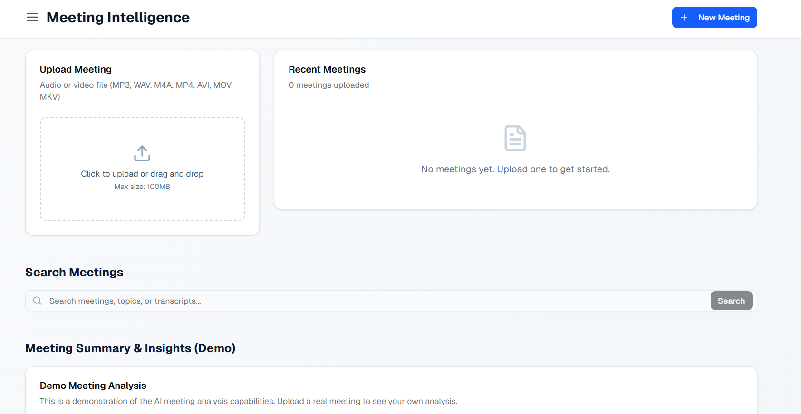

# 🚀 AI Meeting Intelligence Platform

**An open-source web application that transforms meeting recordings into actionable insights, comprehensive summaries, and searchable knowledge using cutting-edge AI technologies.**

Transform your post-meeting workflow with intelligent audio/video processing, automated transcription, speaker identification, and AI-powered analysis that extracts key decisions, action items, and sentiment from your meetings.


*Architecture of AI Meeting Intelligence Platform*

## ✨ Key Features

*   **🎯 Intelligent Audio/Video Processing** - Support for multiple formats (MP4, WAV, MP3, AVI, MOV, MKV) with robust file validation
*   **🎙️ High-Fidelity Transcription** - Whisper.cpp-powered speech-to-text with speaker diarization using Pyannote.audio
*   **🤖 AI-Powered Summarization** - Generate comprehensive summaries, key points, and action items using Ollama/OpenAI LLMs
*   **💭 Sentiment Analysis** - Analyze emotional tone and highlight contentious or positive moments
*   **🔍 Vector Search & Knowledge Base** - ChromaDB-powered semantic search across all meeting content
*   **📊 Real-time Processing** - Asynchronous task processing with Celery and Redis for scalable performance
*   **🎨 Modern UI/UX** - React (Next.js) frontend with Tailwind CSS and Shadcn UI components
*   **🛡️ Production Ready** - Health checks, error handling, retry mechanisms, and graceful degradation

## 🛠️ Technology Stack

| **Category** | **Technology** | **Purpose** |
|:-------------|:---------------|:------------|
| **Frontend** |    | Modern web framework with utility-first CSS |
| **Backend** |   | High-performance async web framework |
| **Database** |   | Lightweight relational database with ORM |
| **Task Queue** |   | Asynchronous task processing |
| **AI/ML** |    | Speech-to-text, speaker diarization, LLM |
| **Media Processing** |  | Audio/video conversion and preprocessing |
| **Vector DB** |   | Vector storage and LLM orchestration |
| **Infrastructure** |  | Containerization and deployment |


*Representation of the project*

> 📋 **[Technical Documentation](docs/technical-overview.md)** - Comprehensive architecture analysis, AI pipeline implementation, and engineering challenges

## 📁 Project Structure

```
AI-Meeting-Intelligence-Platform/
├── 📁 backend/                    # FastAPI backend services
│   ├── 📁 app/                    # Main application code
│   │   ├── 📁 api/               # REST API endpoints
│   │   ├── 📁 services/          # Core business logic
│   │   └── 📁 db/                # Database models & config
│   ├── 📁 uploads/               # Processed meeting files
│   └── 📁 whisper.cpp/           # Local Whisper installation
├── 📁 frontend/                   # Next.js React frontend
│   ├── 📁 app/                    # Next.js app router
│   ├── 📁 components/             # Reusable UI components
│   └── 📁 lib/                   # API client & hooks
├── 📁 docs/                      # Documentation
│   ├── 📁 images/                # Project screenshots & diagrams
│   └── 📄 technical-overview.md  # Detailed technical documentation
└── 📄 README.md                  # This file
```


## Quick Start
```bash
# 1) Start Redis (Docker)
docker run -d -p 6379:6379 redis

# 2) Backend (from backend/)
python -m venv .venv && . ./.venv/Scripts/activate  # Windows
# python3 -m venv .venv && source .venv/bin/activate # macOS/Linux
pip install -r requirements.txt

# 3) FFmpeg + Whisper.cpp (see detailed setup below)

# 4) Env
copy .env.example .env  # then fill values

# 5) Run services
uvicorn app.main:app --reload
celery -A worker.celery_app worker --loglevel=info -P eventlet

# 6) Open API docs
# http://127.0.0.1:8000/docs
```

---

## Backend: Setup & Run

### 1) Prerequisites
- Python 3.10+
- Docker Desktop (for Redis)
- Git

### 2) Create venv and install deps
```bash
cd backend
python -m venv .venv && . ./.venv/Scripts/activate  # Windows
# python3 -m venv .venv && source .venv/bin/activate # macOS/Linux
pip install --upgrade pip
pip install -r requirements.txt
```

### 3) External tools
- FFmpeg is required for audio preprocessing
  - Windows: download from `https://ffmpeg.org/download.html` and ensure `ffmpeg.exe` is available, or set `FFMPEG_PATH` in `.env`.
  - macOS: `brew install ffmpeg`
  - Linux: `sudo apt update && sudo apt install ffmpeg`

- Whisper.cpp for transcription
  - Windows: follow `backend/SETUP_WHISPER.md` for prebuilt binaries and model download
  - macOS/Linux (source build):
    ```bash
    git clone https://github.com/ggerganov/whisper.cpp.git
    cd whisper.cpp && make
    ./models/download-ggml-model.sh base
    ```

### 4) Environment variables
Create `backend/.env` (use `.env.example` as a guide):
```bash
DATABASE_URL=sqlite:///./meetings.db
CELERY_BROKER_URL=redis://127.0.0.1:6379/0
CELERY_RESULT_BACKEND=redis://127.0.0.1:6379/0

# FFmpeg
FFMPEG_PATH=./ffmpeg-master-latest-win64-gpl/bin/ffmpeg.exe    # Windows example

# Whisper.cpp binary + model
WHISPER_CPP_PATH=./whisper.cpp/Release/main.exe                 # Windows example
WHISPER_CPP_MODEL_PATH=./ggml-base.bin                          # or ./whisper.cpp/models/ggml-base.bin

# Diarization (optional; enables Pyannote)
HF_TOKEN=your_huggingface_token

# LLMs
OLLAMA_BASE_URL=http://127.0.0.1:11434
OLLAMA_MODEL=llama3.2:1b
OPENAI_API_KEY=your_openai_key

# Chroma (vector store) path
CHROMA_DB_PATH=./chroma_langchain_db
```

Fail-fast checks are available at:
- Health: `GET /health`
- Readiness: `GET /ready` (checks DB, Redis, FFmpeg, Whisper.cpp path)

### 5) Start infrastructure
```bash
# Redis
docker run -d -p 6379:6379 redis

# Stop later (find container ID first)
docker ps
docker stop <container-id>
```

### 6) Run backend services
In two terminals (with `backend/.venv` activated):
```bash
# API
uvicorn app.main:app --reload --port 8000

# Celery worker
celery -A worker.celery_app worker --loglevel=info -P eventlet
```

### 7) Initialize database (first run)
```bash
python -c "from app.db import models, database; models.Base.metadata.create_all(bind=database.engine)"
```

### 8) Test
- Open Swagger UI: `http://127.0.0.1:8000/docs`
- Upload endpoint: `POST /api/v1/meetings/upload` (accepts .mp4/.mp3/.wav/.m4a/.avi/.mov/.mkv, ≤100MB)
- Status: `GET /api/v1/meetings/{id}/status`
- Details: `GET /api/v1/meetings/{id}`
- Search: `GET /api/v1/search?query=...&top_k=5`

Notes:
- If `HF_TOKEN` is not set, diarization is skipped and speakers are marked `UNKNOWN_SPEAKER`.
- If Ollama/OpenAI are unavailable, insight generation may fail; the task auto-retries.

---

## Frontend: Setup & Run
```bash
cd frontend
npm install
npm run dev
# http://localhost:3000
```

---

## Whisper, FFmpeg, Tokens, and Keys

### FFmpeg
Ensure `ffmpeg` is installed and on PATH, or set `FFMPEG_PATH` in `.env`.

### Whisper.cpp
See `backend/SETUP_WHISPER.md` for Windows prebuilt setup, model downloads, and verification commands.

### Hugging Face Token (Pyannote)
Set `HF_TOKEN` in `.env` to enable diarization. Without it, diarization is skipped gracefully.

### OpenAI API Key
Set `OPENAI_API_KEY` to enable OpenAI embeddings via LangChain. Chunks are stored in Chroma at `CHROMA_DB_PATH`.

---

## API Overview
- Ingestion: `POST /api/v1/meetings/upload`
- Status: `GET /api/v1/meetings/{id}/status`
- Details: `GET /api/v1/meetings/{id}`
- Search: `GET /api/v1/search?query=...&top_k=5`
- Health: `GET /health`
- Ready: `GET /ready`

---

## Operational Tips
- Logs: Celery logs pipeline progress; FastAPI logs requests and health checks.
- Storage: Uploaded files are stored under `backend/uploads/`.
- Rate limits: Consider limiting large uploads and embedding throughput for production.

---

## Alternative: Deepgram for STT and Diarization
You may opt to use Deepgram’s APIs for speech-to-text and diarization as a managed alternative to local Whisper.cpp + Pyannote. This can reduce setup complexity and improve scale. See Deepgram’s site: [Deepgram Voice AI Platform](https://deepgram.com/).

---

## Project Scripts (reference)
```bash
# Start Redis (Docker)
docker run -d -p 6379:6379 redis

# Stop container (find ID first with: docker ps)
docker stop container-id

# Run FastAPI (from backend/)
uvicorn app.main:app --reload

# Run Celery worker (from backend/)
celery -A worker.celery_app worker --loglevel=info -P eventlet
```

---

## Troubleshooting
- `/ready` returns 503: verify Redis is running, FFmpeg is installed, Whisper paths exist.
- Upload fails: verify file extension and ensure file size ≤ 100MB.
- Insights fail: ensure Ollama is running and `OLLAMA_MODEL` is available, or set `OPENAI_API_KEY`.

---