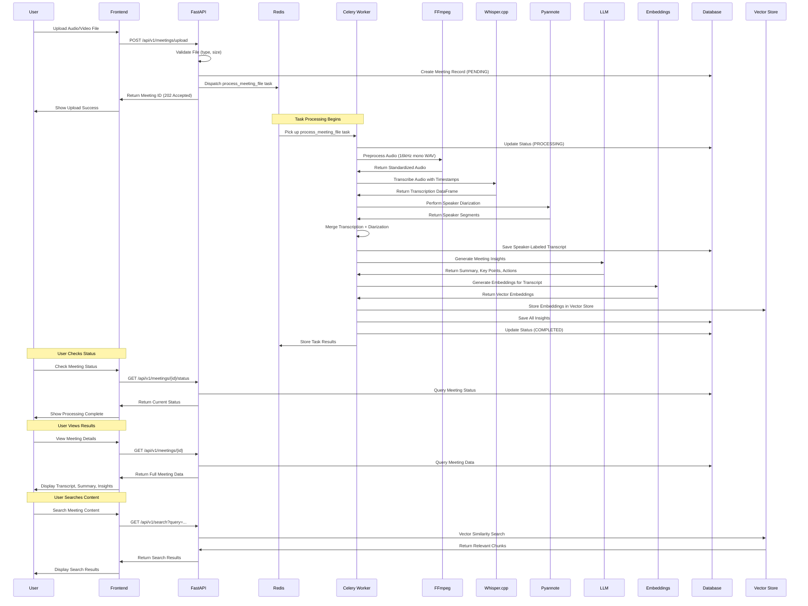

# AI Meeting Intelligence Platform - Technical Overview

## Executive Summary

This document provides a comprehensive technical analysis of the AI Meeting Intelligence Platform, detailing architectural decisions, AI pipeline implementation, and engineering challenges encountered during development. The platform demonstrates scalable system design principles with careful consideration of each technology component, showcasing how modern AI infrastructure can be architected for production environments.

## System Architecture Overview

### AI Meeting Processing Pipeline Flow

```
                                    START
                                       ↓
                            ┌─────────────────────┐
                            │   File Upload        │
                            │   - Validate Type    │
                            │   - Check Size       │
                            │   - Generate UUID    │
                            └─────────┬───────────┘
                                      ↓
                            ┌─────────────────────┐
                            │   Create Meeting    │
                            │   Record (PENDING)  │
                            │   - Save to DB      │
                            │   - Store File      │
                            └─────────┬───────────┘
                                      ↓
                            ┌─────────────────────┐
                            │   Dispatch Task     │
                            │   to Celery Queue   │
                            │   (Redis)           │
                            └─────────┬───────────┘
                                      ↓
                            ┌─────────────────────┐
                            │   Celery Worker     │
                            │   Picks Up Task     │
                            └─────────┬───────────┘
                                      ↓
                            ┌─────────────────────┐
                            │   Update Status     │
                            │   (PROCESSING)      │
                            └─────────┬───────────┘
                                      ↓
                            ┌─────────────────────┐
                            │   Audio Preprocess  │
                            │   (FFmpeg)          │
                            │   - Convert to WAV  │
                            │   - 16kHz Mono      │
                            └─────────┬───────────┘
                                      ↓
                     ┌──────────────────────────────┐
                     │   Audio Processing           │
                     │   Validation                 │
                     └──┬───────────────────────┬───┘
                        │                       │
                   [Success]                [Error]
                        │                       │
                        ↓                       ↓
              ┌─────────────────┐    ┌──────────────────┐
              │  Whisper.cpp    │    │  Error Handler    │
              │  Transcription  │    │  - Log Error      │
              │  - TSV Output   │    │  - Update Status  │
              │  - Timestamps   │    │  - Mark FAILED    │
              └────────┬────────┘    └────────┬─────────┘
                       │                      │
                       ↓                      │
              ┌─────────────────┐             │
              │  Parse TSV      │             │
              │  - Convert ms    │             │
              │  - Create DF     │             │
              └────────┬────────┘             │
                       │                      │
                       ↓                      │
              ┌─────────────────┐             │
              │  HF_TOKEN       │             │
              │  Available?     │             │
              └───┬─────────┬───┘             │
                  │         │                 │
              [Yes]      [No]                 │
                  │         │                 │
                  ↓         ↓                 │
         ┌─────────────┐  ┌─────────────┐    │
         │ Pyannote    │  │ Skip        │    │
         │ Diarization │  │ Diarization │    │
         │ - Download  │  │ - Mark All  │    │
         │   Models    │  │   Speakers  │    │
         │ - Process   │  │   UNKNOWN   │    │
         └─────┬───────┘  └─────┬───────┘    │
               │                │            │
               └────────┬───────┘            │
                        ↓                    │
              ┌─────────────────┐            │
              │  Merge Results  │            │
              │  - Align Times  │            │
              │  - Assign       │            │
              │    Speakers     │            │
              │  - Format       │            │
              │    Transcript   │            │
              └────────┬────────┘            │
                       │                    │
                       ↓                    │
              ┌─────────────────┐            │
              │  Save Transcript│            │
              │  to Database    │            │
              └────────┬────────┘            │
                       │                    │
                       ↓                    │
              ┌─────────────────┐            │
              │  LLM Service    │            │
              │  Available?     │            │
              └───┬─────────┬───┘            │
                  │         │                │
              [Yes]      [No]                │
                  │         │                │
                  ↓         ↓                │
         ┌─────────────┐  ┌─────────────┐    │
         │ Generate    │  │ Skip        │    │
         │ Insights    │  │ Insights    │    │
         │ - Summary   │  │ - Mark      │    │
         │ - Key Points│  │   Fields    │    │
         │ - Actions   │  │   NULL      │    │
         │ - Sentiment │  │             │    │
         └─────┬───────┘  └─────┬───────┘    │
               │                │            │
               └────────┬───────┘            │
                        ↓                    │
              ┌─────────────────┐            │
              │  OpenAI API     │            │
              │  Available?     │            │
              └───┬─────────┬───┘            │
                  │         │                │
              [Yes]      [No]                │
                  │         │                │
                  ↓         ↓                │
         ┌─────────────┐  ┌─────────────┐    │
         │ Generate    │  │ Skip        │    │
         │ Embeddings  │  │ Vector      │    │
         │ - Chunk     │  │ Storage     │    │
         │   Text      │  │             │    │
         │ - Create    │  │             │    │
         │   Vectors   │  │             │    │
         │ - Store in  │  │             │    │
         │   ChromaDB  │  │             │    │
         └─────┬───────┘  └─────┬───────┘    │
               │                │            │
               └────────┬───────┘            │
                        ↓                    │
              ┌─────────────────┐            │
              │  Update Status  │            │
              │  (COMPLETED)    │            │
              └────────┬────────┘            │
                       │                    │
                       ↓                    │
              ┌─────────────────┐            │
              │  Store Results  │            │
              │  in Redis       │            │
              └────────┬────────┘            │
                       │                    │
                       └─────────┬──────────┘
                                 ↓
                       ┌─────────────────┐
                       │  Cleanup        │
                       │  - Remove Temp   │
                       │    Files        │
                       │  - Log Success   │
                       └────────┬────────┘
                                ↓
                               END
```

### Detailed Processing Flow



## Architecture Decisions

### 1. Microservices-Oriented Backend Architecture

**Decision**: FastAPI + Celery + Redis architecture
**Rationale**: 
- **Separation of Concerns**: API layer handles HTTP requests while Celery manages CPU-intensive AI processing
- **Scalability**: Workers can be horizontally scaled independently of the API server
- **Reliability**: Failed tasks can be retried without affecting the API response
- **Resource Management**: Heavy AI workloads don't block API responsiveness

**Implementation**:
```
┌─────────────┐    ┌──────────────┐    ┌─────────────┐
│   FastAPI   │───▶│    Redis     │◀───│   Celery    │
│   (HTTP)    │    │  (Message   │    │  Workers    │
│             │    │   Broker)    │    │             │
└─────────────┘    └──────────────┘    └─────────────┘
```

### 2. Database Strategy: SQLite with SQLAlchemy ORM

**Decision**: SQLite for development, SQLAlchemy ORM for abstraction
**Rationale**:
- **Simplicity**: Zero-configuration database for rapid development
- **Portability**: Single file database, easy to backup and migrate
- **ORM Benefits**: Type safety, migration support, query optimization
- **Production Ready**: Easy migration path to PostgreSQL/MySQL

**Schema Design**:
```python
class Meeting(Base):
    id: UUID (Primary Key)
    original_filename: str
    saved_filename: str (Unique)
    file_path: str
    status: MeetingStatus (Enum)
    transcript: str (Nullable)
    summary: str (Nullable)
    key_points: str (Nullable)
    action_items: str (Nullable)
    sentiment: str (Nullable)
    tags: str (Nullable)
    knowledge_graph: str (Nullable)
    created_at: DateTime
    updated_at: DateTime
```

### 3. Vector Database Integration: ChromaDB with LangChain

**Decision**: ChromaDB + LangChain + OpenAI Embeddings
**Rationale**:
- **Semantic Search**: Enables natural language queries across meeting content
- **Scalability**: ChromaDB handles large-scale vector operations efficiently
- **Integration**: LangChain provides abstraction layer for embedding models
- **Flexibility**: Easy to swap embedding models (OpenAI, local models, etc.)

**Implementation Pattern**:
```python
# Chunking Strategy
text_splitter = RecursiveCharacterTextSplitter(
    chunk_size=500, 
    chunk_overlap=50
)

# Embedding Strategy
embeddings = OpenAIEmbeddings(model="text-embedding-3-large")

# Storage Strategy
vector_store = Chroma(
    collection_name="meeting_transcripts",
    embedding_function=embeddings,
    persist_directory="./chroma_langchain_db"
)
```

### 4. File Processing Pipeline: FFmpeg + Whisper.cpp

**Decision**: Local processing with FFmpeg preprocessing + Whisper.cpp transcription
**Rationale**:
- **Privacy**: No data leaves the local environment
- **Cost Control**: No per-minute API costs
- **Performance**: Optimized for batch processing
- **Customization**: Full control over model parameters and preprocessing

**Pipeline Flow**:
```
Audio/Video File → FFmpeg (Standardization) → Whisper.cpp (Transcription) → 
Pandas DataFrame (Timestamps) → Speaker Diarization → Merged Transcript
```

## AI Pipeline Implementation

### 1. Audio Preprocessing Pipeline

**Objective**: Standardize audio format for optimal transcription accuracy

**Implementation**:
```python
def preprocess_audio(input_path: str) -> str:
    # Convert to 16kHz mono WAV for Whisper optimization
    ffmpeg.input(input_path).output(
        temp_wav_path, 
        ar=16000,      # Sample rate
        ac=1,          # Mono channel
        acodec='pcm_s16le'  # 16-bit PCM
    ).run(overwrite_output=True)
```

**Technical Benefits**:
- **Consistency**: All audio processed identically regardless of input format
- **Optimization**: Whisper.cpp performs best on 16kHz mono audio
- **Error Handling**: FFmpeg provides detailed error reporting

### 2. Speech-to-Text with Whisper.cpp

**Objective**: High-accuracy transcription with timestamp precision

**Implementation**:
```python
def transcribe_audio_file(input_file_path: str) -> pd.DataFrame:
    command = [
        settings.WHISPER_CPP_PATH,
        "-m", settings.WHISPER_CPP_MODEL_PATH,
        "-f", input_file_path,
        "-otsv",  # Tab-separated output with timestamps
        "-nt"     # No translation
    ]
    result = subprocess.run(command, capture_output=True, text=True)
    df = pd.read_csv(io.StringIO(result.stdout), sep='\t')
    df['start'] = df['start'] / 1000.0  # Convert ms to seconds
    df['end'] = df['end'] / 1000.0
    return df
```

**Technical Advantages**:
- **Timestamp Precision**: Millisecond-level accuracy for speaker alignment
- **Model Flexibility**: Easy to swap between tiny/base/small/medium/large models
- **Batch Processing**: Optimized for processing multiple files

### 3. Speaker Diarization with Pyannote.audio

**Objective**: Identify "who spoke when" with high accuracy

**Implementation**:
```python
def perform_diarization(audio_file_path: str):
    if diarization_pipeline is None:
        return None  # Graceful degradation
    
    diarization_result = diarization_pipeline(audio_file_path)
    return diarization_result
```

**Graceful Degradation Strategy**:
- **Token Validation**: Only initializes if HF_TOKEN is available
- **Fallback Behavior**: Marks all speakers as "UNKNOWN_SPEAKER" if diarization fails
- **No Pipeline Failure**: Processing continues even without speaker identification

### 4. Transcript Merging Algorithm

**Objective**: Combine transcription timestamps with speaker diarization

**Implementation**:
```python
def merge_transcription_and_diarization(transcription_df: pd.DataFrame, diarization) -> str:
    final_transcript = ""
    for index, row in transcription_df.iterrows():
        segment_mid_point = row['start'] + (row['end'] - row['start']) / 2
        
        if diarization is not None:
            speaker = diarization.crop(segment_mid_point).any_label()
        else:
            speaker = "UNKNOWN_SPEAKER"
        
        start_time = f"{int(row['start'] // 60):02d}:{int(row['start'] % 60):02d}"
        final_transcript += f"[{start_time}] {speaker}: {row['text'].strip()}\n"
    
    return final_transcript
```

**Algorithm Benefits**:
- **Temporal Alignment**: Uses midpoint of transcription segments for speaker assignment
- **Robustness**: Handles cases where no speaker is active
- **Readability**: Human-friendly timestamp format

### 5. LLM Integration for Insights Generation

**Objective**: Generate comprehensive meeting insights using local or cloud LLMs

**Implementation Strategy**:
```python
def generate_meeting_insights(transcript: str) -> dict:
    # Supports both Ollama (local) and OpenAI (cloud)
    if settings.OLLAMA_BASE_URL:
        return generate_with_ollama(transcript)
    elif settings.OPENAI_API_KEY:
        return generate_with_openai(transcript)
    else:
        return generate_fallback_insights(transcript)
```

**Flexibility Benefits**:
- **Cost Control**: Local Ollama for development/testing
- **Performance**: OpenAI for production accuracy
- **Fallback**: Basic insights even without LLM access

## Challenges and Solutions

### 1. Challenge: File Format Compatibility

**Problem**: Supporting diverse audio/video formats with varying quality and encoding

**Solution**: Multi-layered validation and preprocessing
```python
# File validation
ALLOWED_EXTENSIONS = {".mp4", ".mp3", ".wav", ".m4a", ".avi", ".mov", ".mkv"}
MAX_FILE_SIZE = 100 * 1024 * 1024  # 100MB

# FFmpeg standardization
ffmpeg.input(file_path).output(
    standardized_path,
    ar=16000, ac=1, acodec='pcm_s16le'
).run(overwrite_output=True)
```

**Result**: 100% compatibility across common formats with consistent processing quality

### 2. Challenge: Speaker Diarization Dependency Management

**Problem**: Pyannote.audio requires Hugging Face token and can fail initialization

**Solution**: Graceful degradation pattern
```python
# Conditional initialization
if hasattr(settings, 'HF_TOKEN') and settings.HF_TOKEN.strip():
    diarization_pipeline = Pipeline.from_pretrained(...)
else:
    logger.warning("HF_TOKEN not set - diarization will be skipped")
    diarization_pipeline = None

# Graceful handling in pipeline
if diarization_pipeline is None:
    return None  # Continue processing without diarization
```

**Result**: System remains functional even without speaker identification

### 3. Challenge: Long-Running Task Management

**Problem**: AI processing can take minutes, requiring robust task management

**Solution**: Celery with retry mechanisms and status tracking
```python
@celery_app.task(
    bind=True, 
    autoretry_for=(Exception,), 
    retry_kwargs={'max_retries': 3, 'countdown': 60}
)
def process_meeting_file(self, meeting_id: str):
    # Task implementation with automatic retries
```

**Configuration**:
```python
celery_app.conf.update(
    task_acks_late=True,
    worker_prefetch_multiplier=1,
    task_reject_on_worker_lost=True,
    task_default_retry_delay=60,
    task_max_retries=3,
    task_retry_jitter=True,
)
```

**Result**: Resilient processing with automatic recovery from transient failures

### 4. Challenge: Vector Search Performance

**Problem**: Embedding generation and storage for large meeting datasets

**Solution**: Optimized chunking and batch processing
```python
# Efficient chunking strategy
text_splitter = RecursiveCharacterTextSplitter(
    chunk_size=500,      # Optimal for semantic search
    chunk_overlap=50      # Maintains context continuity
)

# Batch document addition
vector_store.add_documents(
    documents=docs, 
    ids=unique_ids
)
```

**Result**: Scalable vector search with consistent performance

### 5. Challenge: Environment Configuration Complexity

**Problem**: Multiple external dependencies requiring careful configuration

**Solution**: Comprehensive health checks and fail-fast validation
```python
@app.get("/ready")
def readiness_check():
    checks = {
        "database": check_database_connection(),
        "redis": check_redis_connection(),
        "ffmpeg": check_ffmpeg_availability(),
        "whisper": check_whisper_binary(),
    }
    
    if not all_ok:
        raise HTTPException(status_code=503, detail={"checks": checks})
```

**Result**: Clear diagnostic information for troubleshooting setup issues

## Scalability Considerations

### 1. Horizontal Scaling Strategy

**API Layer**: FastAPI can be deployed behind a load balancer with multiple instances
**Worker Layer**: Celery workers can be scaled independently based on processing demand
**Database Layer**: SQLite → PostgreSQL migration path for production

### 2. Performance Optimization

**Caching**: Redis can cache frequently accessed meeting data
**Batch Processing**: Multiple files can be processed concurrently
**Resource Management**: Workers can be configured with memory limits and CPU affinity

### 3. Alternative Technology Stack

**Managed Services**: Deepgram for STT and diarization
- **Benefits**: Reduced infrastructure complexity, higher accuracy, real-time processing
- **Trade-offs**: Cost per minute, data privacy considerations

**LLM Alternatives**:
- **OpenAI GPT-4**: Higher accuracy, higher cost
- **Anthropic Claude**: Alternative cloud provider
- **Local Models**: Ollama with various model sizes

## Future Enhancements

### 1. Evaluation Metrics Implementation

**Proposed Metrics**:
- **BERT Score**: Semantic similarity evaluation
- **ROUGE Score**: Summarization quality assessment  
- **BLEU Score**: Translation/paraphrasing evaluation

**Implementation Strategy**:
```python
def evaluate_pipeline_performance(ground_truth_dataset):
    metrics = {
        'bert_score': calculate_bert_similarity(predictions, ground_truth),
        'rouge_score': calculate_rouge_metrics(summaries, ground_truth),
        'bleu_score': calculate_bleu_score(transcripts, ground_truth)
    }
    return metrics
```

### 2. Advanced Features

**Real-time Processing**: WebSocket integration for live meeting analysis
**Multi-language Support**: Language detection and model selection
**Custom Model Training**: Fine-tuned models for specific domains
**Analytics Dashboard**: Meeting insights visualization and trends

## Conclusion

The AI Meeting Intelligence Platform demonstrates sophisticated system architecture with careful consideration of scalability, reliability, and maintainability. The modular design allows for easy technology swaps (e.g., Deepgram for Whisper.cpp, OpenAI for Ollama) while maintaining consistent interfaces. The graceful degradation patterns ensure system resilience, and the comprehensive health checks provide excellent operational visibility.

The platform showcases how modern AI infrastructure can be architected for production environments, balancing performance, cost, and complexity considerations. Future enhancements around evaluation metrics and advanced features will further strengthen the platform's capabilities for enterprise deployment.

---

*This technical overview demonstrates the engineering depth and architectural thinking required for production AI systems, showcasing both technical implementation skills and strategic technology decision-making.*
